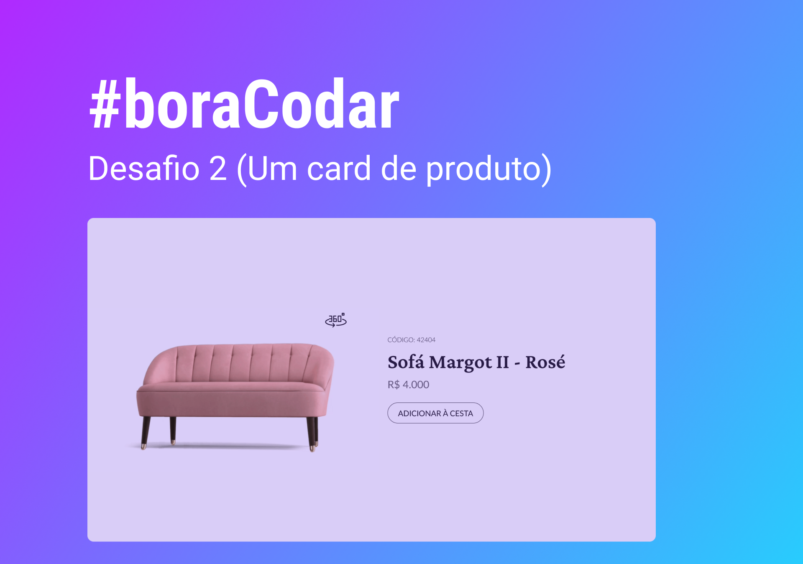

# Card de Produto
- Desafio #02 do [#bordacodar](https://boracodar.dev)

## 🛠️ Stack utilizada
- HTML 
- CSS
- JAVASCRIPT

## ⬆️ Melhorias Futuras
- Trocar a imagem estática por um modelo 3D navegável ao arrastar o mouse